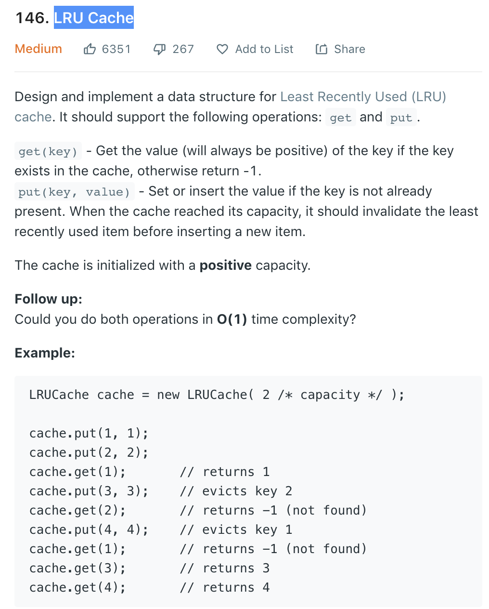

# LRU Cache



- 这个题实现时要注意get和put方法操作某个key时，都要对key的优先级进行调整，也符合最近最少使用的淘汰原则

## 双向链表
- 这个题如果要维护一个时间上的优先关系，双向链表是一个不错的数据结构，单项链表断链和重组比较麻烦
- 双向链表的方法有两种实现形式。一种使用链表node，一种是使用dict。
- 使用doublelink-node
    ```
    class Node:
        def __init__(self, k, v):
            self.key = k
            self.val = v
            self.prev = None
            self.next = None

    class LRUCache:
        def __init__(self, capacity):
            self.capacity = capacity
            self.dic = dict()
            self.head = Node(0, 0)
            self.tail = Node(0, 0)
            self.head.next = self.tail
            self.tail.prev = self.head

        def get(self, key):
            if key in self.dic:
                n = self.dic[key]
                self._remove(n)
                self._add(n)
                return n.val
            return -1

        def set(self, key, value):
            if key in self.dic:
                self._remove(self.dic[key])
            n = Node(key, value)
            self._add(n)
            self.dic[key] = n
            if len(self.dic) > self.capacity:
                n = self.head.next
                self._remove(n)
                del self.dic[n.key]

        def _remove(self, node):
            p = node.prev
            n = node.next
            p.next = n
            n.prev = p

        def _add(self, node):
            p = self.tail.prev
            p.next = node
            self.tail.prev = node
            node.prev = p
            node.next = self.tail
    ```
- 使用双dict
    ```
    class LRUCache:
        def __init__(self, MSize):
            self.size = MSize
            self.cache = {}
            self.next, self.before = {}, {}
            self.head, self.tail = '#', '$'
            self.connect(self.head, self.tail)

        def connect(self, a, b):
            self.next[a], self.before[b] = b, a

        def delete(self, key):
            self.connect(self.before[key], self.next[key])
            del self.before[key], self.next[key], self.cache[key]

        def append(self, k, v):
            self.cache[k] = v
            self.connect(self.before[self.tail], k)
            self.connect(k, self.tail)
            if len(self.cache) > self.size:
                self.delete(self.next[self.head])

        def get(self, key):
            if key not in self.cache: return -1
            val = self.cache[key]
            self.delete(key)
            self.append(key, val)
            return val

        def put(self, key, value):
            if key in self.cache: self.delete(key)
            self.append(key, value)
    ```
- 举例说明双dict的链表流程
    ```
    lru = LRUCache(4)
    for i, v in enumerate('abcde'):
        lru.put(i, v)
        print('next:', lru.next)
        print('before:', lru.before)

    >>> 
    next: {'#': 0, 0: '$'}
    before: {'$': 0, 0: '#'}
    next: {'#': 0, 0: 1, 1: '$'}
    before: {'$': 1, 0: '#', 1: 0}
    next: {'#': 0, 0: 1, 1: 2, 2: '$'}
    before: {'$': 2, 0: '#', 1: 0, 2: 1}
    next: {'#': 0, 0: 1, 1: 2, 2: 3, 3: '$'}
    before: {'$': 3, 0: '#', 1: 0, 2: 1, 3: 2}
    next: {'#': 1, 1: 2, 2: 3, 3: 4, 4: '$'}
    before: {'$': 4, 1: '#', 2: 1, 3: 2, 4: 3}
    # 相当于每一个dict维护一个单链，且两个dict的方向相反
    ```
## 使用OrderedDict
- 此方法利用到了OrderedDict的有序特性，而且
    ```
    from collections import OrderedDict
    class LRUCache:
        def __init__(self, Capacity):
            self.size = Capacity
            self.cache = OrderedDict()

        def get(self, key):
            if key not in self.cache: return -1
            val = self.cache[key]
            self.cache.move_to_end(key)
            return val

        def put(self, key, val):
            if key in self.cache: del self.cache[key]
            self.cache[key] = val
            if len(self.cache) > self.size:
                self.cache.popitem(last=False)
    ```
    - move_to_end: 移动某个key值到端尾（最新的端）
    - popitem：默认pop最新的端key-value，last=False，pop最早的端