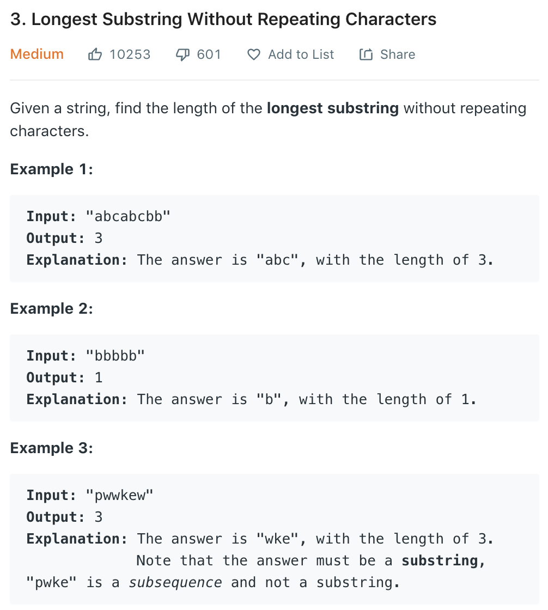

# Longest Substring Without Repeating Characters



-----


## 暴力求解
- 直接的做法是暴力求解
- 固定一个起点$i$，计算$s(i, j)$是否有重复
- 时间复杂度是$O({ n }^{ 3 })$

## 滑动窗口
- 该方法在**数组和字符串**题目中会经常用到，学会其思想
- 方法：
  - 定义窗口$[i, j)$
  - 滑动边界，对于本题目，首先滑动$j$边界，如果窗口中没有重复的字符，持续滑动并持续更新最长的字符串。
  - 窗口内为了快速判断是否有重复的字符，需要使用 hashset
  - 如果发现有重复的字符，滑动$i$，并移除$i$的字符，直至没有重复字符的窗口

```
def lengthOfLongestSubstring(self, s: str) -> int:
    n = len(s)
    ans = 0
    hash_table = set()
    
    i = 0
    j = 0
    while i < n and j < n:
        if s[j] not in hash_table:
            hash_table.add(s[j])
            j += 1
            ans = max(ans, j-i)
        else:
            hash_table.remove(s[i])
            i += 1    
            
    return ans
```
## 滑动窗口优化
- 上述方法中，时间复杂度在最差情况下是$2n$，因为当有重复的字符时，需要逐个的移动$i$。
- 而当出现重复的字符时，其实只需要把$i$更新到重复字符那里即可，不需要逐个移动。这里我们需要使用$hashtable$的$key-value$形式记录字符的下标。
- 另外考虑到字符的数位是有限的，故使用数组代替$dict$
```
def lengthOfLongestSubstring(self, s: str) -> int:
    n = len(s)
    ans = 0
    index = [-1] * 128
    start = -1
    for i in range(n):
        if index[ord(s[i])] > start:
            start = index[ord(s[i])]
        index[ord(s[i])] = i
        ans = max(ans, i-start)
    return ans
```


